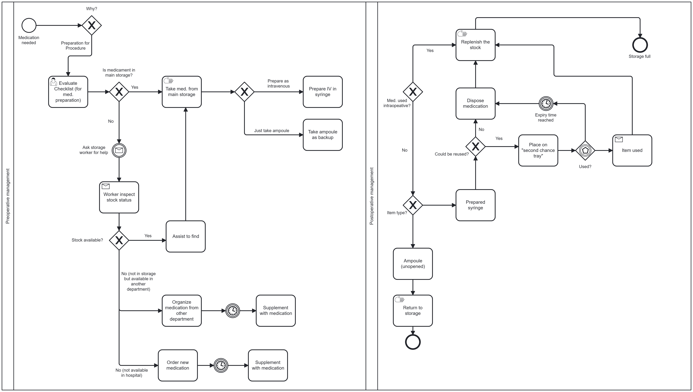
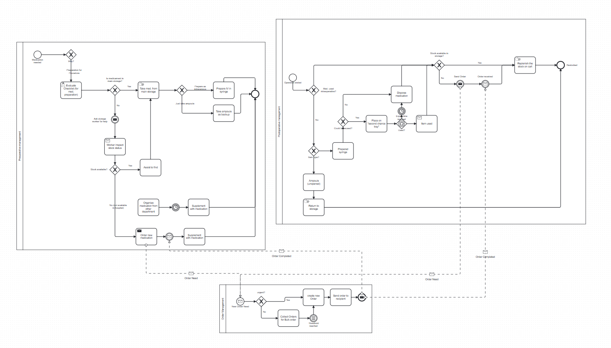
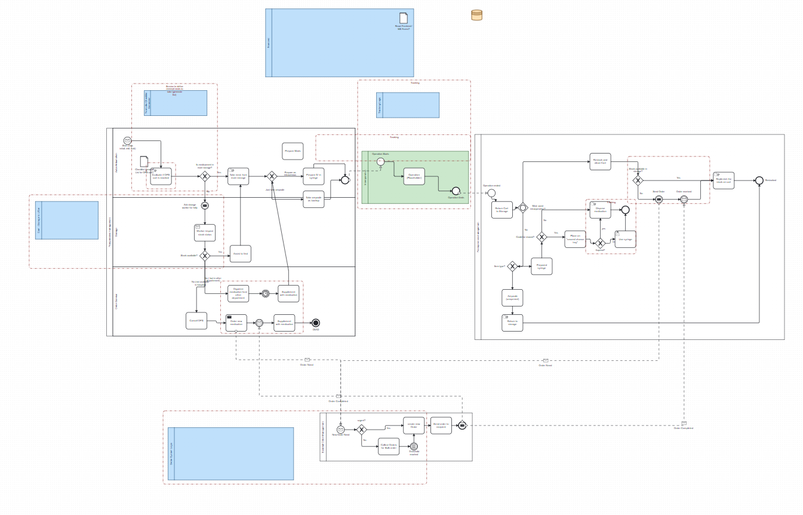

# Medication Preparation Process (BPMN)

This BPMN model describes the medication preparation and storage workflow (still in progress, draft version).

## Original Idea Version of BPMN



## V2 Idea Version of BPMN



## V3 Version of BPMN



## Defined Roles in Team: (Please Adapt if you want to also do other stuff)

| Who       | Role                      |
| --------- | ------------------------- |
| Donna     | Medical Expert            |
| Viktorija | Medical Expert            |
| Dj        | Data Specialist / Backend |
| Merel     | APIs and Frontend         |
| Janosh    | BMPN and Backend          |

# Next Steps TILL 20.11:

| Done? | What                                                                                                                                                                                                                                               | Who                        |
| ----- | -------------------------------------------------------------------------------------------------------------------------------------------------------------------------------------------------------------------------------------------------- | -------------------------- |
| [X]   | Update Businessplan and Readme                                                                                                                                                                                                                     | Janosh                     |
| [X]   | Define all the Users and Stakeholders of the System (eg. All the People who will interact with the System like "Storage Worker", "Nurse", "Doctor"... etc.) -> Define for "AS-IS" so we can then adapt to "SHOULD-BE"                              | Donna and Viktorija        |
| [X]   | Define Data Objects (Checklist, Communication between Storage Worker, What info is needed to make an order, what should be stored about the medication in the Database (e.g. Name, Formula, Exp. data, producer, dosage...) Idealy in JSON format) | Viktorija and Donna        |
| [ ]   | Design the Frontend Elements, how would Doctors, Nurses etc want to interact with the System, how sould it look like (e.g. as a Mockup)                                                                                                            | Donna, Viktorija and Merel |
| [X]   | Define Teckstack used (e.g. Frontend (Vuejs) Backend(express?), DB (Postgresql), logic (Python), Workflow (Camunda or N8n?))                                                                                                                       | All                        |

# Next Steps TILL 27.11:

| Done? | What                                          | Who               | % Done |
| ----- | --------------------------------------------- | ----------------- | ------ |
| [X]   | Set up Database                               | Djordji           |        |
| [X]   | Design Backend APIS                           | Djorgdi , Merel   |        |
| [X]   | Setup frontend with mockup for main views     | Merel             | 99%    |
| [ ]   | Finalize Data elements in JSON                | Donna & Viktorija |        |
| [ ]   | Update Projectplan and Summarize Developement | Janosh            |        |
| [ ]   | Start Modeling Flow in Camunda / Langflow     | Janosh            |        |

# Next Steps TILL 06.12:

| Done? | What                                                     | Who | % Done |
| ----- | -------------------------------------------------------- | --- | ------ |
| [ ]   | Couple backend with Camundo (Orders internal+ external ) |     |        |
| [ ]   | Demo user story                                          |     |        |
| [ ]   | Transform Demo user story into Frontend/Backend/Camunda  |     |        |
| [ ]   | Think about AI possibilities                             |     |        |

## Users and Stakeholders (e.g please Update)

### AS-IS Stakeholders

- Storage Worker
- Nurse
- Doctor
- Pharmacist
- Administrator

### SHOULD-BE Stakeholders

- Storage Worker (automated ordering)
- Nurse (digital ordering interface)
- Doctor (prescription system)
- Pharmacist (inventory management)
- Administrator (system oversight)

## Data Objects

### Medication Data Template (JSON)

```json

See medication_data_template.json

```

## Teckstack

- frontend : vuejs
- backend : FastAPI
- DB : sqllight (@Dj need to specify exactly what)
- logic : Python
- Workflow : Langflow

## Frontend Mockups

### Proposed Screens

- <del>[ ] Login Screen</del> -> waiting time
- [ ] Dashboard (Overview of orders and inventory)
- [ ] Order Creation Form
- [ ] Inventory Management View
- <del>[ ] User Profile/Settings<del> -> waisting time
- [ ] Reports and Analytics

## V3 Version of BPMN


