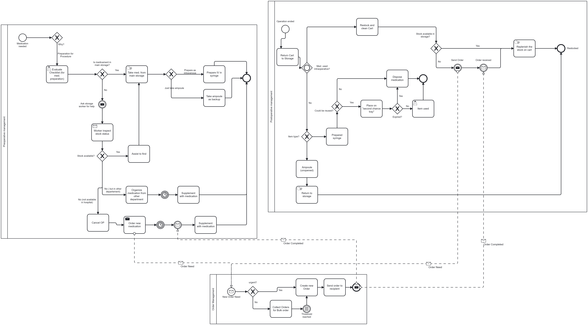
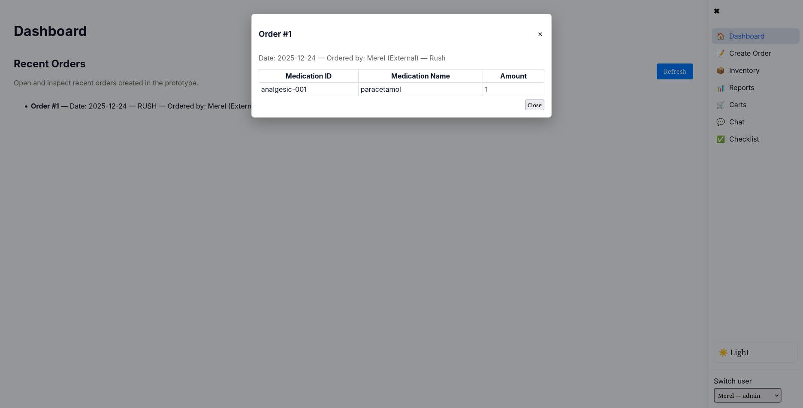
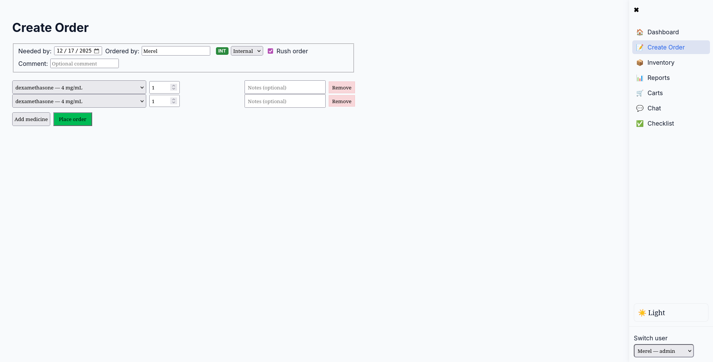
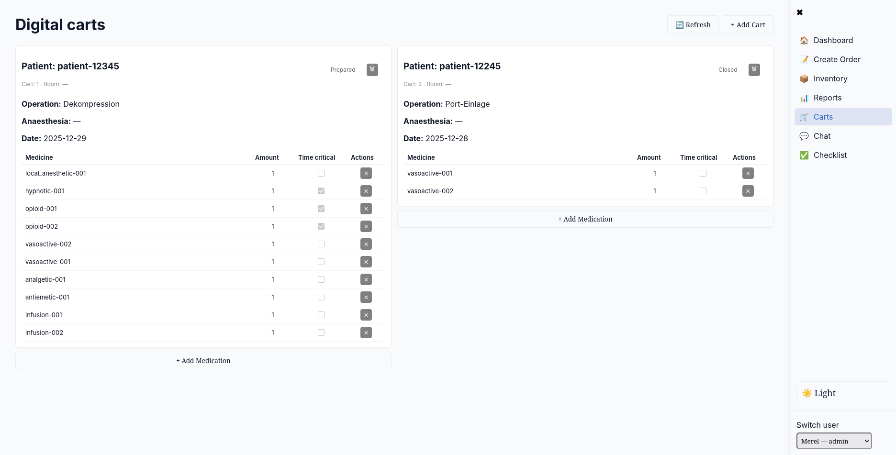
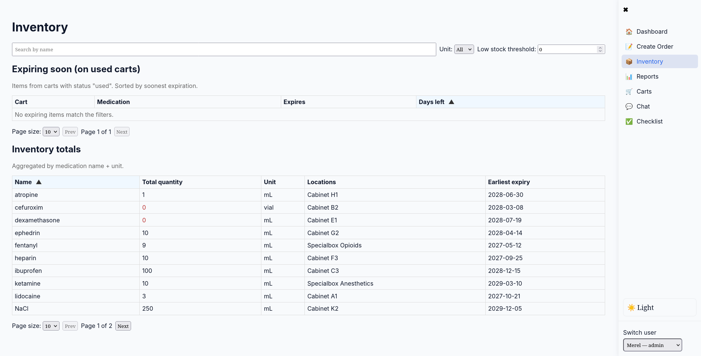
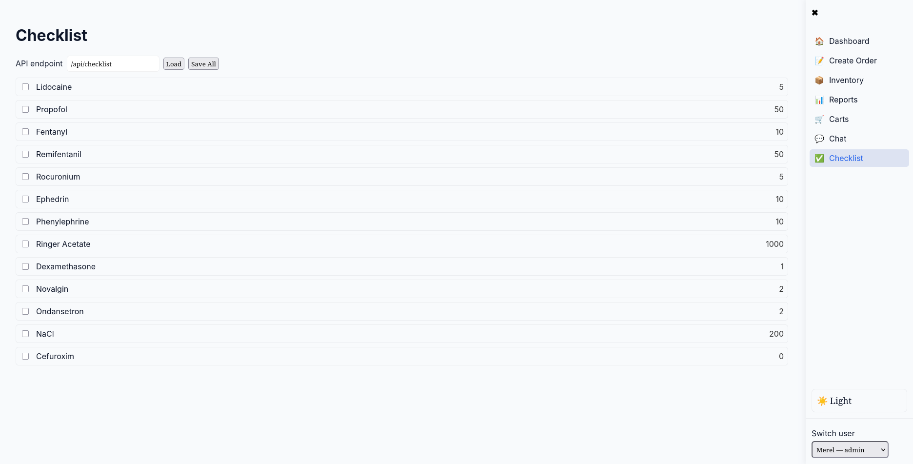
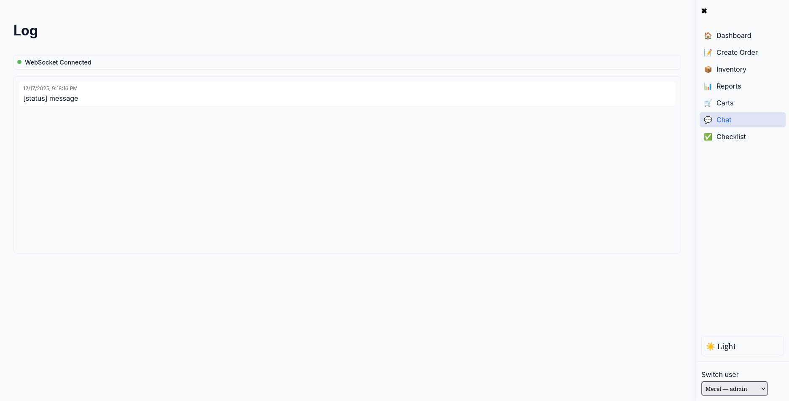

# Medication Preparation & Stock Management System

### **Team: Gotthard Panorama Express**


## Table of Contents

- [Project Members](#project-members)
- [Abstract & Project Overview](#abstract--project-overview)
- [AS-IS Process](#as-is-process)
  - [Key Limitations of the AS-IS Process](#key-limitations-of-the-as-is-process)
  - [AS-IS BPMN Diagram](#as-is-bpmn-diagram)
  - [Project Goal](#project-goal)
- [TO-BE Process](#to-be-process)
  - [TO-BE BPMN Diagram](#to-be-bpmn-diagram)
  - [Challenges and Requirements](#challenges-and-requirements-addressed-by-the-to-be-process)
  - [Users and Stakeholders](#users-and-stakeholders)
- [Technologies Used](#technologies-used)
- [Workflow Orchestration](#workflow-orchestration)
  - [Camunda BPMN Engine](#camunda-bpmn-engine)
  - [n8n Integration & AI Storage Worker](#n8n-integration--ai-storage-worker)
  - [End-to-End Flow](#end-to-end-flow)
- [Limitations](#limitations)

---

# Project members

## Project Team / Authors

| Name      | Role                      | Email                                    |
| --------- | ------------------------- | ---------------------------------------- |
| Janosh    | BPMN and Backend          | janosh.werlen@students.fhnw.ch           |
| Dj        | Data Specialist / Backend | djordji.pavloski@students.fhnw.ch        |
| Merel     | APIs and Frontend         | annemerel.dejong@students.fhnw.ch        |
| Donna     | Medical Expert            | donna.tennigkeit@students.fhnw.ch        |
| Viktorija | Medical Expert            | viktorija.kenstaviciute@students.fhnw.ch |

## Supervisors

| Name               | Email                      |
| ------------------ | -------------------------- |
| Andreas Martin     | andreas.martin@fhnw.ch     |
| Charuta Pande      | charuta.pande@fhnw.ch      |
| Devid Montecchiari | devid.montecchiari@fhnw.ch |

---

## Abstract & Project Overview

In large anaesthesia departments, medication preparation and stock management are still largely **manual**, fragmented, and poorly documented. Every day, medications are prepared, partially used, stored for reuse, or discarded — yet these steps are often **not digitally tracked**. As a result, hospitals face unnecessary medication waste, high operational costs, inefficient workflows, and limited transparency.

This project designs and prototypes a **digital medication preparation and stock management system** for anaesthesia department. Using **process modeling (AS-IS / TO-BE)** and a prototype system design, the project aims to standardize workflows (e.g. order/preparation process steps), improve traceability, and support automation of daily clinical and storage activities. The solution focuses on making medication handling more transparent,and efficient without disrupting existing clinical routines.

[⬆️ Back to Top](#table-of-contents)

---

# AS-IS Process

## Key Limitations of the AS-IS Process

Anaesthesia teams handle large volumes of **high-value, time-critical medications** under strict safety and availability requirements. However, current workflows suffer from several structural limitations:

### No Digital Tracking of Medication Usage

Prepared syringes or vials may be partially used, reused later, or discarded, but these actions are rarely documented, resulting in:

- unnecessary disposal of usable medication (unnecessary costs)
- no structured second-use management
- consumption data is incomplete or inaccurate

### Manual Storage and Medication Location

Medication storage is managed manually, and large storage areas make it difficult to quickly locate specific medications. As a result:

- high dependency on storage workers for information
- no real-time overview of stock levels
- risk of overlooked expiry dates
- manual reordering
- frequent interruptions of storage staff
- delays in clinical procedures
- lack of transparency across departments

Together, these issues cause significant **time loss, medication waste, and avoidable costs**, while preventing reliable planning and optimization of anaesthesia medication supply.

## AS-IS BPMN Diagram



---

## Project Goal

The goal of this project is to **digitalize and streamline medication preparation and stock management in anaesthesia** through an integrated Medication Preparation & Management System.

The system aims to:

- provide real-time visibility into medication preparation, usage, reuse, return, and disposal with up-to-date available quantities
- reduce medication waste and expiry-related losses
- enable fast medication search, location, and restocking
- improve coordination between clinical staff and storage personnel and also departments
- increase transparency and traceability through a digital checklist for medication preparation workflows

[⬆️ Back to Top](#table-of-contents)

---

# TO-BE Process

This chapter describes the redesigned and digitalized **medication preparation and stock management process** for anaesthesia department.  
The TO-BE process replaces fragmented, manual activities with a **standardized, transparent, and partially automated workflow** that supports both clinical staff and storage personnel.

The process is modeled using **BPMN (TO-BE)** and serves as the foundation for a prototype system architecture consisting of a frontend interface, backend services, a workflow engine, and a central database.  
The overall goal is to improve traceability, reduce waste, and provide better guidance for locating and restocking medications, without disrupting established clinical routines.

## TO-BE BPMN Diagram


_Figure: TO-BE BPMN model of the digital medication preparation and stock management process._

## Challenges and Requirements Addressed by the TO-BE Process

| Challenge                                           | Requirement                                                   |
| --------------------------------------------------- | ------------------------------------------------------------- |
| Medication usage is **not tracked**                 | Automated tracking of preparation, usage, reuse, and disposal |
| Stock levels are **managed manually**               | Real-time inventory visibility                                |
| Expiry dates are **checked late or inconsistently** | Automated expiry monitoring and alerts                        |
| Medication is **hard to locate**                    | Digital search and location guidance                          |
| High **time and cost overhead**                     | Workflow automation and reduced manual coordination           |

---

## Users and Stakeholders

### AS-IS Stakeholders

- Storage Worker
- Nurse
- Doctor
- Pharmacist
- Administrator

### TO-BE Stakeholders (SHOULD-BE)

- Storage Worker _(automated ordering support)_
- Nurse _(digital ordering interface)_
- Doctor _(prescription system integration)_
- Pharmacist _(inventory + preparation management)_
- Administrator _(system oversight)_

---

## Data Objects

### Medication Data Template (JSON)

The project uses structured medication objects to ensure consistent storage and API communication.

```json
See medication_data_template.json

```

---

## TO-BE Workflow (Conceptual Step Overview)

The TO-BE workflow follows a structured sequence:

1. **Medication preparation**  
   Medication is prepared according to standardized steps and documented digitally to ensure clarity and traceability.
   After the procedure, the medication status is explicitly evaluated:

   - fully used
   - partially used and eligible for storage
   - or discarded

   This decision is captured in the workflow and determines the subsequent process path.

2. **Medication Usage and Post-Procedure Handling**  
   If medication is **fully used**, the process continues with documentation and closes the preparation cycle.
   If medication is **partially used**, the workflow guides the user to:

   - document remaining quantity
   - decide on storage eligibility
   - and assign a storage location

   Discarded medication is recorded accordingly to maintain transparency and accountability.

3. **Storage and availability Management**  
   Stored medication becomes visible within the system as available stock.  
   The TO-BE process ensures that:

   - storage locations are documented
   - available quantities are updated

4. **Restocking and coordination**  
   The TO-BE process explicitly models interactions between:
   - anaesthesia staff (preparation and usage)
   - storage workers (availability and restocking)
   - and system-supported documentation steps.

The TO-BE process digitalises documentation, coordination, decision points, and inventory visibility, while deliberately leaving physical preparation and clinical judgment manual.

---

### Scope Clarification

The TO-BE model focuses on **process structure, documentation, and coordination**.
Advanced features such as automated alerts, predictive analytics, or forecasting are intentionally **out of scope** and not represented in the BPMN model.

The BPMN serves as a **conceptual and prototype-level design**, providing a solid foundation for future digital extensions.

[⬆️ Back to Top](#table-of-contents)

---

# Technologies Used🛠

- Frontend: Vue.js
- Backend: FastAPI
- Database: PostgreSQL, docker
- Business Logic: Python
- Workflow Engine: Camunda, n8n

[⬆️ Back to Top](#table-of-contents)

---

# Workflow Orchestration

This section describes how the Camunda BPMN engine orchestrates the medication preparation workflow and how n8n bridges external systems and AI services to automate key decision points.

## Camunda BPMN Engine

**Camunda** is the central workflow orchestration engine that controls the entire medication preparation and stock management process.

### Key Responsibilities:

1. **Process Definition & Execution**

   - Executes the TO-BE BPMN workflow model stored in Camunda
   - Manages process instances for each medication order/preparation cycle
   - Maintains process state and variable persistence

2. **External Task Management**

   - Delegates specific tasks to external workers (Python backend)
   - Tasks are handled via a topic-based subscription model
   - Workers communicate back to Camunda with task completion results

3. **Process Instances**
   - Can be started via REST API: `POST /engine-rest/process-definition/key/{processKey}/tenant-id/mi25gotthard/start`
   - Variables (medication ID, amount, patient info) are passed as process variables
   - Example start request:
     ```json
     {
       "variables": {
         "medication_id": { "value": "opioid-001", "type": "String" },
         "medication_name": { "value": "fentanyl", "type": "String" },
         "amount": { "value": 20, "type": "Integer" }
       }
     }
     ```

### Camunda Topics & Python Worker Handlers

The Python backend (`worker.py`) subscribes to the following Camunda topics:

| Topic                | Handler Function            | Purpose                                                     |
| -------------------- | --------------------------- | ----------------------------------------------------------- |
| `inventory-check`    | `handle_inventory_check`    | Fetch current stock levels from backend database            |
| `ai-check`           | `handle_ai_check`           | Query n8n/storage AI for medication availability & location |
| `update-stock`       | `handle_update_stock`       | Update inventory after medication is dispensed              |
| `create-order`       | `handle_create_order`       | Create a new order record in the backend database           |
| `update-checklist`   | `handle_update_checklist`   | Update medication checklist after AI verification           |
| `check-carts`        | `handle_check_carts`        | Query available medication preparation carts                |
| `create-cart`        | `handle_create_cart`        | Create a new cart and populate with checklist items         |
| `update-cart-status` | `handle_update_cart_status` | Update cart status (e.g., "Prepared" → "In-Use")            |

### Configuration

- **Camunda Base URL:** `https://digibp.engine.martinlab.science/engine-rest`
- **Tenant ID:** `mi25gotthard`
- **Authentication:** Username: `mi25gotthard`, Password: `password`

---

## n8n Integration & AI Storage Worker

**n8n** is a workflow automation platform that integrates with Camunda to handle AI-powered decisions and external system queries.

### Architecture Overview

n8n runs as a separate service and exposes webhook endpoints that Camunda's Python worker calls during the `ai-check` task. The n8n workflow orchestrates:

1. **AI Storage Worker** (via OpenAI GPT-4 Mini)

   - Receives medication inquiries (name, ID, required amount)
   - Queries AI language model to simulate storage worker decision-making
   - Determines if spare stock is available at alternative storage locations
   - Returns structured JSON response with availability decision

2. **Webhook-Based Communication**
   - n8n exposes a webhook endpoint for incoming medication check requests
   - Python worker sends POST request to n8n webhook with medication details
   - n8n processes the request and responds with availability/location data

### n8n Workflow Nodes

The n8n workflow (`My workflow_v4.json`) contains the following key nodes:

- **Webhook Receivers**

  - `Webhook5`: Receives medication checklist initialization requests
  - `Webhook6`: Receives medication availability queries from Python worker
  - `Webhook7`: Receives cart status queries

- **AI Processing**

  - `OpenAI Chat Model5`: Integrates with OpenAI API for AI decision-making
  - `AI Storage worker5`: LangChain agent that interprets AI responses
  - `Structured Output Parser5`: Ensures responses conform to expected JSON schema

- **HTTP Requests**
  - Send requests to backend API endpoints for persisting data

### n8n Endpoints

| Webhook ID                             | Purpose                            |
| -------------------------------------- | ---------------------------------- |
| `04ced486-2466-431f-b1fd-ea604848459b` | Checklist initialization           |
| `ea2b22f1-ce36-4988-8f59-f67b7ce05c6b` | Medication availability check (AI) |
| `8c450380-3c3a-4de5-a3e4-5d030687aa1f` | Cart information retrieval         |

### Example AI Storage Worker Prompt

```
You are a storage worker. You receive an order for a medication that is not available and
you check other storage locations for spare stock.
You must respond only with valid JSON that matches this structure, with no extra text,
explanations, or comments.

If you find the requested amount, respond with:
{"found": "Yes", "text": "Yes! We still have some left, I'll bring them by."}

If you do not find the requested amount, respond with:
{"found": "No", "text": "Sorry, we seem to not have any left, I'll order more."}
```

---

## End-to-End Flow

Here's how Camunda and n8n work together in a typical medication preparation scenario:

```
1. Process Start (Frontend/API)
   └─→ POST /engine-rest/process-definition/key/Process_1gnj26y/start
       Variables: medication_id, medication_name, amount, etc.

2. Inventory Check Task (Camunda → Python Worker)
   └─→ Camunda publishes "inventory-check" task
       Python worker calls: GET /api/inventory/{medication_id}
       Backend returns current stock level

3. Decision: Is Stock Sufficient?
   ├─→ YES: Proceed to create-cart
   └─→ NO: Continue to AI check

4. AI Check Task (Camunda → Python Worker → n8n)
   └─→ Camunda publishes "ai-check" task
       Python worker sends POST to n8n webhook: /webhook/ea2b22f1-ce36-4988-8f59-f67b7ce05c6b
       Payload: {"medication_name": "...", "medication_id": "...", "amount": ...}

       n8n workflow executes:
       ├─→ OpenAI Chat Model receives prompt with medication details
       ├─→ LangChain agent interprets AI response
       └─→ Structured Output Parser ensures valid JSON format

       n8n returns: {"found": "Yes/No", "text": "..."}
       Python worker completes task with AI result

5. Update Checklist (Camunda → Python Worker)
   └─→ Camunda publishes "update-checklist" task
       Python worker updates checklist item status based on AI result
       Backend marks medication as "found" or "not found"

6. Cart Management (Camunda → Python Worker)
   ├─→ Create Cart: POST /api/carts/ with patient/operation info
   ├─→ Add Items: POST /api/cart-items/ for each medication
   └─→ Update Status: PATCH /api/carts/{id}/status to "In-Use"

7. Order Creation (Camunda → Python Worker)
   └─→ Camunda publishes "create-order" task
       Python worker creates order record in backend
       Order linked to medications and quantities needed

8. Process Complete
   └─→ Workflow terminates with final state (Success/Failure)
```

### Real-Time Frontend Notifications

Throughout the workflow, the Python worker sends notifications to the frontend via the backend API:

```python
POST /api/notifications/workflow-event
{
  "event_type": "Bridge",
  "message": "[Bridge] Asking AI/Storage about: fentanyl"
}
```

This allows the frontend to display real-time workflow progress and status updates to users.

---

[⬆️ Back to Top](#table-of-contents)

---

# Limitations

- **Prototype-level implementation:** The project demonstrates the concept and workflow design, not a production-ready system.
- **No hospital system integration:** Interfaces to real clinical systems (e.g., HIS/EMR, pharmacy systems, barcode/RFID, procurement) are out of scope.
- **No analytics/forecasting features:** Automated alerts, and predictive planning are not implemented in this version.
- **Manual demo input:** For demonstration purposes, some data entries and status updates are performed manually.

[⬆️ Back to Top](#table-of-contents)

---

# Frontend screenshots

The following screenshots demonstrate the key features of the medication preparation and stock management system's frontend interface:

## Dashboard View


_Main dashboard displaying recent orders overview with real-time updates and refresh capabilities._

## Order Creation View


_Create new medication orders with medication selection, quantity input, and rush order options._

## Digital Carts View


_Manage and track digital medication preparation carts with real-time status updates._

## Inventory View


_Monitor medication stock levels, locations, and availability across storage areas._

## Checklist View


_Digital checklist for medication preparation workflows ensuring standardized processes and quality control._

## Workflow Log View


_Real-time workflow event logging and monitoring for transparency and process tracking._

[⬆️ Back to Top](#table-of-contents)

---

# Our project Forkflow Agenda

## Next Steps due by 20.11:

| Done? | What                                                                                                                                                                                                                                                | Who                 |
| ----- | --------------------------------------------------------------------------------------------------------------------------------------------------------------------------------------------------------------------------------------------------- | ------------------- |
| [X]   | Update Businessplan and Readme                                                                                                                                                                                                                      | Janosh              |
| [X]   | Define all the Users and Stakeholders of the System (eg. All the People who will interact with the System like "Storage Worker", "Nurse", "Doctor"... etc.) -> Define for "AS-IS" so we can then adapt to "SHOULD-BE"                               | Donna and Viktorija |
| [X]   | Define Data Objects (Checklist, Communication between Storage Worker, What info is needed to make an order, what should be stored about the medication in the Database (e.g. Name, Formula, Exp. data, producer, dosage...) Ideally in JSON format) | Viktorija and Donna |
| [X]   | Design the Frontend Elements, how would Doctors, Nurses etc want to interact with the System, how should it look like (e.g. as a Mockup)                                                                                                            | Merel               |
| [X]   | Define Teckstack used (e.g. Frontend (Vuejs) Backend(express?), DB (Postgresql), logic (Python), Workflow (Camunda or N8n?))                                                                                                                        | All                 |

## Next Steps due by 27.11:

| Done? | What                                          | Who               | % Done |
| ----- | --------------------------------------------- | ----------------- | ------ |
| [X]   | Set up Database                               | Djordji           | 100%   |
| [X]   | Design Backend APIS                           | Djorgdi , Merel   | 100%   |
| [X]   | Setup frontend with mockup for main views     | Merel             | 100%   |
| [X]   | Finalize Data elements in JSON                | Donna & Viktorija | 100%   |
| [X]   | Update Projectplan and Summarize Developement | Janosh            | 100%   |
| [ ]   | Start Modeling Flow in Camunda / Langflow     | Janosh            | 98%    |

## Next Steps due by 06.12:

| Done? | What                                                            | Who                    | % Done |
| ----- | --------------------------------------------------------------- | ---------------------- | ------ |
| [X]   | Couple backend with Camunda (Orders internal+ external )        | Djorgdi, Merel, Janosh | 100%   |
| [X]   | Demo user story                                                 | Viktorija              | 100%   |
| [X]   | Transform Demo user story into Frontend/Backend/Camunda         | Djorgdi, Merel, Janosh | 100%   |
| [X]   | Think about AI possibilities                                    | All                    | 100%   |
| [X]   | Deployment, Markdown documentation and testing of group project | All                    | 100%   |

## Next Steps due by 17.12:

| Done? | What                          | Who | % Done |
| ----- | ----------------------------- | --- | ------ |
| [X]   | Finalisation of group project | All | 100%   |
